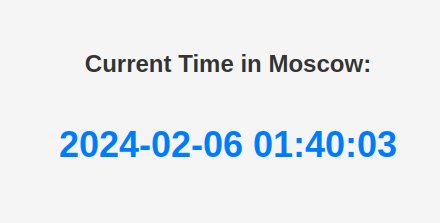

# Python Web Application - Moscow Time

## Overview

This Python web application displays the current time in Moscow. 

- `app`: Contains the Flask application and routes.
- `static`: Holds static files such as CSS.
- `tests`: Includes unit tests for the Flask application.
- `templates`: Contains HTML templates for rendering.

## How to Run the Program

1. **Clone Repository:** 
   ```bash 
   git clone -b lab01 https://github.com/bruteforceboy/S24-core-course-labs/
   ```

2. Navigate to the project directory:
   ```bash 
   cd S24-core-course-labs/app_python/
   ```
3. **Install Dependencies:**

   Ensure you have Python installed on your machine. You can install project dependencies using the following command:
   ```bash
   pip install -r requirements.txt
   ```
4. **Running the Flask Application:** 

	Execute the following commands:
   ```bash
   export FLASK_APP=app.routes	
   export FLASK_ENV=development
   flask run
   ```
   Can be displayed by visiting [localhost:5000](127.0.0.1/5000)
   \
   

5. **Unit Tests:**

   Execute the following command:
   ```bash
	python3 -m unittest tests.test_flask_app.FlaskAppTest
   ```

## Docker 

### Building the Docker Image (Locally)

1. **Building the image**
   ```bash 
   docker build -t app_python .
   ```
2. **Running the container at [localhost:5000](127.0.0.1/5000)**
   ```bash 
   docker run -d -p 5000:5000 --name app_python_container app_python
   ```

### Building the Docker Image (Docker Hub)

1. **Building the image**
   ```bash 
   docker pull cogbonna/app_python_image
   ```
2. **Running the container at [localhost:5000](127.0.0.1/5000)**
   ```bash 
   docker run -dp 0.0.0.0:5000:5000 cogbonna/app_python_image
   ```

## CI Workflow

This CI workflow is responsible for building, testing, ensuring security, and deploying the application. Below are the details of the workflow:

### Workflow File Location
The configuration for this workflow is stored in the `.github/workflows/build-app-python.yaml` file within the project repository.

### Workflow Triggers
This workflow is triggered by pushes to the repository. Specifically, it is triggered when changes occur in the `app_python` directory or in the workflow file itself.

### Jobs 
The CI workflow has three jobs:
- **Build Job:** Tests and lints the code.
- **Security Job:** Ensures code security using Snyk.
- **Docker Job:** Builds and pushes Docker image, but only if the previous jobs succeed.